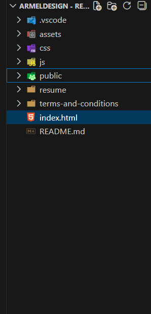

1. Project Title

Personal Website named: ArmelDesign★

2. Description

A responsive personal portfolio website built with HTML and CSS.
It showcases my projects, skills, Web Development services, and contact information in a clean, accessible design.

3. Features

• Responsive design (mobile, tablet & desktop friendly)
• Accessible with proper semantic HTML and ARIA labels
• Sticky navigation bar and hamburger menu
• Custom branding and styling

4. Folder structure

5. Technologies Used

- HTML5
- Modern CSS (Flexbox, Grid, Media Queries)
- Form Handling API from "Web3Forms" (https://docs.web3forms.com)

- Hex Colors from Adobe Palette Color:

- /_ Color Theme Swatches in Hex _/
- Game-Design-1-hex { color: #F2BBC9; }
- Game-Design-2-hex { color: #AFA9D9; } body color
- Game-Design-3-hex { color: #8082A6; } Aside background color
- Game-Design-4-hex { color: #282E40;} Navbar color
- Game-Design-5-hex { color: #F2A172; } Current page color

6. Accessibility & Best Practices

This site follows accessibility best practices:

- Semantic HTML tags
- Proper alt attributes for images
- Language attribute set to `en-GB`

7. Deployment

Live Link : https://armeldesign-solutions.web.app/

8. License

- This project is not an open source but personal.
- This project is licensed under my own brand.
